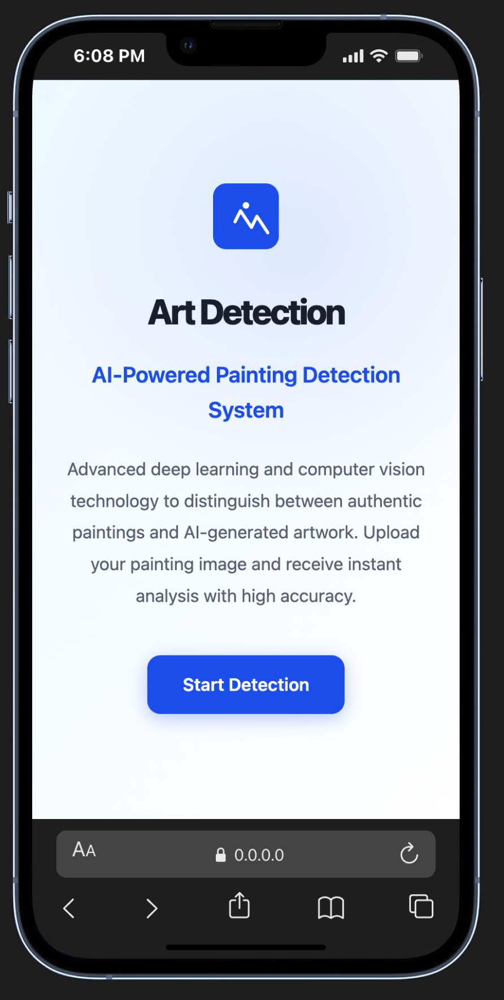
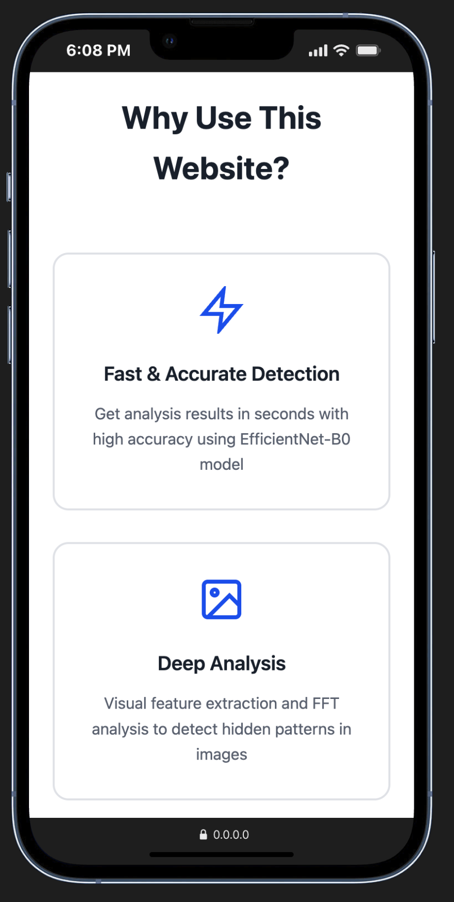
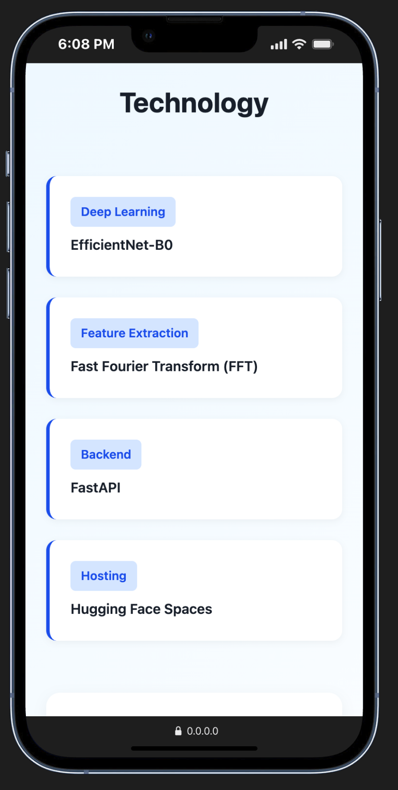
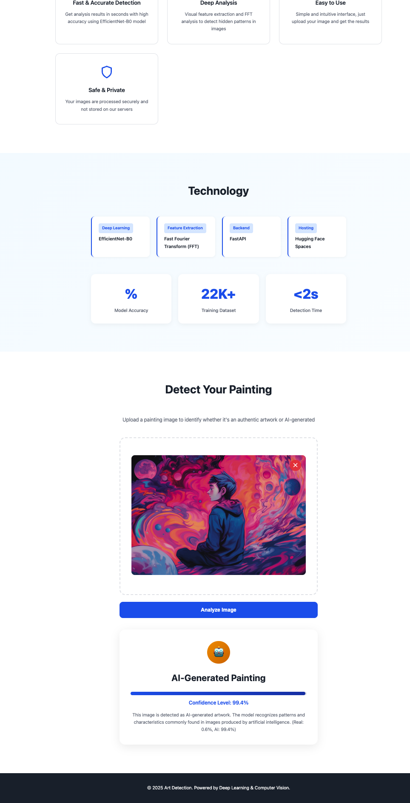

# Art Detection

This project is an image classification API that leverages EfficientNet-B0 combined with FFT (Fast Fourier Transform) preprocessing, built using FastAPI and PyTorch. It is designed to differentiate between AI-generated and real artworks.

## Features

- **EfficientNet-B0** as the main backbone for image classification.
- **FFT-based preprocessing** to enhance detection of subtle signal differences in images.
- **RESTful API** interface using FastAPI.
- **HTML Frontend** for easy upload and testing.
- Supports PNG, JPG, JPEG, and WEBP image formats (max 10MB).
- Provides prediction confidence and class probabilities.

## Project Structure

```
Code/
  ├── app/
  │   ├── main.py             # Main FastAPI service and routing
  │   ├── api.py              # Example/test script for API endpoints
  │   ├── app.py              # Entrypoint for some deployments
  │   ├── image_utils.py      # Image preprocessing utilities (Resize, FFT, etc.)
  │   ├── model_loader.py     # Model loading & prediction logic
  │   └── static/             # Frontend (HTML, JS, CSS)
  ├── models/
  │   └── bestModel.pth       # Best trained PyTorch model
  ├── notebooks/              # (Reserved for experiments, empty by default)
  ├── requirements.txt        # Python dependencies
  └── README.md               # This file
```

## Installation

1. **Clone this repository**

   ```bash
   git clone https://github.com/RafiHana/ART-Detection.git
   cd imageDetection/Code
   ```

2. **Install dependencies**

   ```bash
   pip install -r requirements.txt
   ```

3. **(Optional) Download or place your trained model (`Art Images Dataset.pth`) in the `models/` folder.**

## Usage

### Start the API server

```bash
python app/main.py
```

- The API will be available at: [http://localhost:7860](http://localhost:7860)
- The frontend can be accessed directly at root (`/`) via browser.

### API Endpoints

- `/` : HTML upload page
- `/predict` : POST an image file, returns prediction & confidence

**Example cURL:**

```bash
curl -X POST "http://localhost:7860/predict" \
  -F "file=@path_to_your_image.jpg"
```

### Running API Tests

- You can run the API test script by executing:

  ```bash
  python app/api.py
  ```

  Make sure the API server is running first.

## Model

- The model uses **EfficientNet-B0** with a 2-class classifier (`ai` vs `real`).
- Model files should be placed inside the `models/` folder.
- FFT is applied as a preprocessing step before classification.

## Dataset

This project uses the Real and Fake (AI-Generated) Art Images Dataset from KALEEMULLAH YOUNAS Kaggle:

- [https://www.kaggle.com/datasets/doctorstrange420/real-and-fake-ai-generated-art-images-dataset/data](https://www.kaggle.com/datasets/doctorstrange420/real-and-fake-ai-generated-art-images-dataset/data)

## Notes

- Maximum size per image: **10 MB**
- Only image files (`.png`, `.jpg`, `.jpeg`, `.webp`) are accepted.
- Probabilities for both classes (`ai`, `real`) are returned for each prediction.

## Example Results & Web Interface

### Web Interface Screenshots

Below are screenshots of the website interface:

|  |  |
|:------------------------:|:------------------------:|
| *Landing/analysis page*   | *Detection result page*   |

|  |  |
|:------------------------:|:------------------------:|
| *Upload feature*          | *About or profile page*   |

### Detection Result Example



*Example detection output: The uploaded image is classified as "AI-Generated Painting" with a high confidence level. The model clearly distinguishes between real and AI artwork based on learned visual features.*

## Future Research

Several possible directions for further development and research on this project:

1. **Model Improvements**
   - Experiment with other architectures (e.g., ViT, Swin Transformer) to improve accuracy.
   - Apply ensembling methods or model distillation.
2. **Adversarial Robustness**
   - Evaluate and enhance the model's robustness against adversarial (manipulated) AI images.
3. **Explainability & Visualization**
   - Integrate explainable AI tools (e.g., Grad-CAM, LIME) to visualize why the model classifies an image as AI/real.
4. **Serving & Optimization**
   - Optimize model for faster inference (quantization, ONNX, TensorRT, etc.).
   - Deploy as a container or cloud-based microservice.
5. **Mobile & Edge Deployment**
   - Adapt the model to run efficiently on mobile devices or edge hardware.
6. **User Feedback Loop**
   - Implement a feedback system so real-life misclassifications can be reported and used for continuous improvement.

---

## Authors

- Rafi Hana

---

**Indonesia (ringkasan)**:  
File ini menjelaskan cara instalasi, penggunaan, dan struktur proyek deteksi gambar AI vs asli menggunakan FastAPI dan PyTorch.

---

